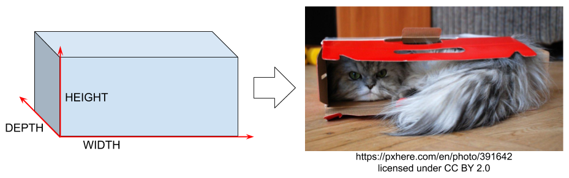
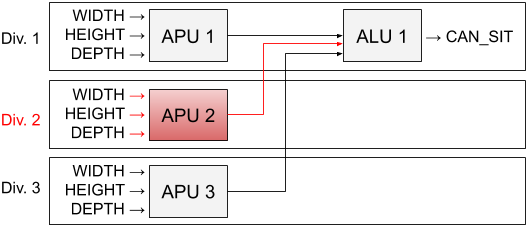

## Introduction

HW-SW-builder is a tool for formal verification of fault-tolerant systems that utilize separation into several redundant *divisions* to achieve fault tolerance. The components of the system need to be modeled using the [NuSMV](http://nusmv.fbk.eu) model checker. The tool is best suited for nuclear instrumentation and control (I&C) systems as it supports fault injection to check *single fault tolerance*.

## Prerequisites

To run the tool, you need Java Runtime Environment (JRE) 1.8 or greater and [ant](https://ant.apache.org/). The tool is intended to work on Linux and Windows.

To (re)build the tool yourself, you need Java Development Kit (JDK) 1.8 or greater and [ant](https://ant.apache.org/).

You need to have [NuSMV](http://nusmv.fbk.eu) installed to perform verification for formal models generated by the tool.

## Building and running

A pre-compiled JAR executable is provided: [hw_sw_builder.jar](/jars/hw_sw_builder.jar).

To (re)build it yourself, from the root of the project run:

> ant

To see a short help explaining how to run the tool, run:

> java -jar jars/hw_sw_builder.jar

Below, we provide an example and explain how to run the tool on it.

## Example

Since the original examples from the nuclear industry that we use are confidential, we provide a different fictitious example that resembles the ECC one but is simpler. In particular, no fault/validity signal processing is used here.

Consider a cognitive system of a cat deciding whether it can fit in a box, and if it fits, I sits. Assume that the cat assesses the width, height and depth of the box, compares them with fixed thresholds and decides to sit if all the comparisons pass. See the illustration below:

Due to the randomness of cats, a failure is possible within the cognitive system. The cognitive system is thus 3-redundant, with each division receiving possibly differing dimension measurements. Specifically, each Animal Perception Unit (APU) checks that the width is at least 200 mm, the height is at least 100 mm and the depth is at least 150 mm, and each Animal Locating Unit (ALU) collects comparison results from all the APUs and issues a sitting command of 2 out of 3 comparisons are successful. We assume that division 2 of this system has a failure and look at the output of division 1. See the acrchitecture of this simplified model on the picture:

The files describing this system are given below:

* [APU NuSMV model](./case_studies/cat_sitting/apu.smv)
* [ALU NuSMV model](./case_studies/cat_sitting/alu.smv)
* [File with auxiliary modules](./case_studies/cat_sitting/basic_blocks.smv) (just one module)
* [File with temporal requirements](./case_studies/cat_sitting/requirements.smv) (see the comments in the file for explanations regarding what should be satisfied and what should not)
* [Configuration file](./case_studies/cat_sitting/cat_sitting.conf) (failure in division 2 is assumed and communication delays should be supplied from command line; also see the description of the language in the bottom of this README file)

To check symmetry declarations specified in the configuration file, run:

> java -jar ../../jars/hw_sw_builder.jar cat_sitting.conf --nusmvCommand "NuSMV" --configSubstitutions "DELAY_APU=0; DELAY_ALU=0" --checkSymmetry

Once the tool is run, its output will be written to [out.smv](./case_studies/cat_sitting/out.smv).

Now, assuming single failure, we are going to see whether the sitting command is issues when all the measurements are acceptable, where it can be issued spuriously and whether a system can enter a deadlock-like state.

To verify temporal requirements without communication delays, run:

> java -ea -jar ../../jars/hw_sw_builder.jar cat_sitting.conf --nusmvCommand "NuSMV -coi -df -dynamic" --configSubstitutions "DELAY_APU=0; DELAY_ALU=0"

With BDD-based LTL model checking, the same run may not terminate within reasonable time if delays are considered. We can use bounded model checking (BMC) to speed things up:

> java -ea -jar ../../jars/hw_sw_builder.jar cat_sitting.conf --nusmvCommand "NuSMV -coi -df -dynamic -bmc -bmc_length 20" --configSubstitutions "DELAY_APU=2; DELAY_ALU=4"

## Configuration language

You can see an example of a configuration file for the tool [here](./case_studies/cat_sitting/cat_sitting.conf).

A configuration file consists of a number of *declarations*, each on its own line. Declarations are processed from top to bottom, and if a declaration refers to some other entity by name, it needs to be declared above.

Empty lines are allowed. Single-line comments are preceded with #.

Types of declarations:

* To specify some filenames: **settings** *basic_blocks_filename*={file with basic blocks used in units; the filename is given relative to the configuration file} *output_filename*={target file to write the generated formal model into; the filename is given relative to the configuration file}
* To add a file with requirements to be checked for the generated models with NuSMV: **add_requirements** *filename*={NuSMV file with temporal requirements; the filename is given relative to the configuration file}
* To declare a unit group (a container of units all having the same number of divisions; failures are specified per unit group): **unit_group** *name*={name, string without spaces} *divisions*={number of divisions, positive integer} *failing_division*={the index of division with failure, positive integer not exceeding the total number of divisions or NA for no failure}
* To declare an input of the overall model: **input** *name*={name, string without spaces} *divisions*={number of divisions, positive integer} *nusmv_type*={NuSMV type without spaces, such as boolean, 0..10 or {1,3,7}}
* To declare an output of the overall model: **output** *name*={name, string without spaces} *divisions*={number of divisions, positive integer}
* To declare a unit within a unit group: **unit** *in*={name of unit group; this unit group must be declared above} *name*={name, string without spaces} *filename*={NuSMV file with the definition of this unit as a single module; the filename is given relative to the configuration file} *nusmv_module_name*={NuSMV module name specified in this file} *max_delay*={maximum delay in cycles for all inputs of this unit, non-negative integer, 0 means no delays} *nusmv_outputs*={;-separated list of module outputs (without separate _FAULT statuses) and their NuSMV types, each entry provided as name:type, no spaces allowed} *single_division_to_retain*={positive integer to retain this unit only in this specific division or NA to keep all its instances}
* To declare symmetry with respect to input variables that can be checked automatically: **symmetry** *group*={unit group name} *unit*={unit name} *input_variable_indices*={comma-separated list of input variable indices (positive integers) such as 1,2,3, all indices must be different, _FAULT and _CONNECTED input variables are invisible here and will be considered together with their base variables during symmetry checks}
* To specify a single connection: **single_connection** *from*={source, see clarification below} to={destination, see clarification below}
* To specify a series of parallel connections for each division (the numbers of divisions in source and destination must match): **parallel_connection** *from*={source} *to*={destination}
* To specify cross-connections between all divisions of the source and all divisions of the target: **all_to_all_connection** *from*={source} *to*={destination}

Additional notes regarding *from* and *to* arguments of connections:

* inputs of the overall model are preceded with "input."
* outputs of the overall model are preceded with "output."
* integer and Boolean constants are allowed in "from" and must be preceded with "const.", e.g. const.TRUE, const.FALSE, const.100, or const.-42
* units are referred to as {unit group name}.{unit name}
* in single connection, division indices are specified in the end after ".", e.g. {unit group name}.{unit name}.2 or input.{input name}.3

Finally, instead of any concrete value for some argument, a placeholder may be specified with ${PLACEHOLDER_NAME} syntax, e.g. single_division_to_retain=${DIVISION_TO_RETAIN}. Such placeholder must be filled using the command line argument --configSubstitutions, e.g. --configSubstitutions "DIVISION_TO_RETAIN=1; SOME_OTHER_PLACEHOLDER=2"

## Misc

You may also be interested in trying the following NuSMV-based tools for formal verification:

* [Tool to explain/visualize counterexamples generated by NuSVM](https://github.com/igor-buzhinsky/nusmv_counterexample_visualizer)
* [User-friendly NuSMV environment FASTEN](https://sites.google.com/site/fastenroot/home)

## Troubleshooting, questions, etc.

Email Igor Buzhinsky (igor.buzhinsky@gmail.com).
